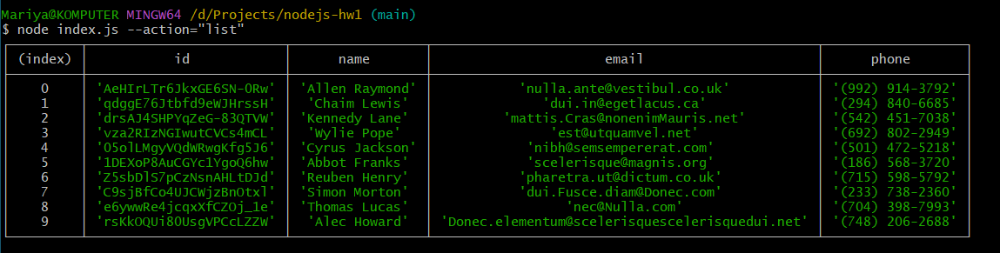
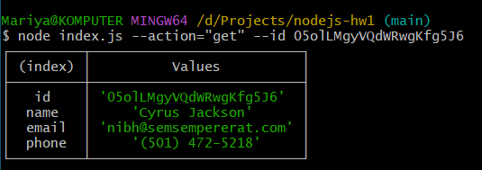
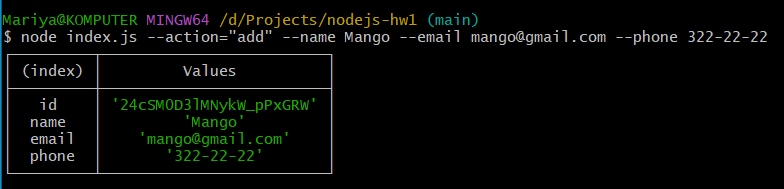
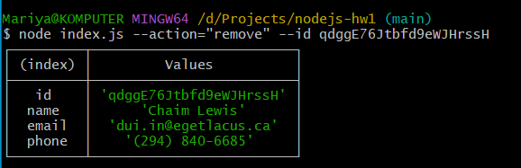
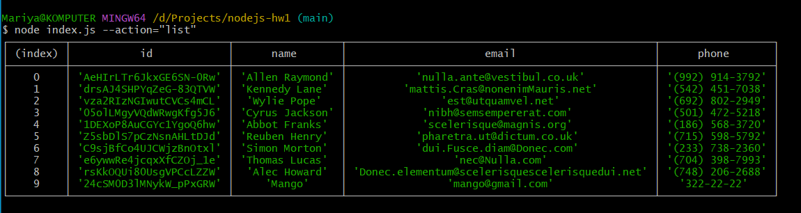

# nodejs-hw1

## Результати виконання кожної команди:

1. Отримуємо і виводимо весь список контактів

2. Отримуємо контакт по id

3. Додаємо контакт

4. Видаляємо контакт

5. Результат після усіх дій користувача

